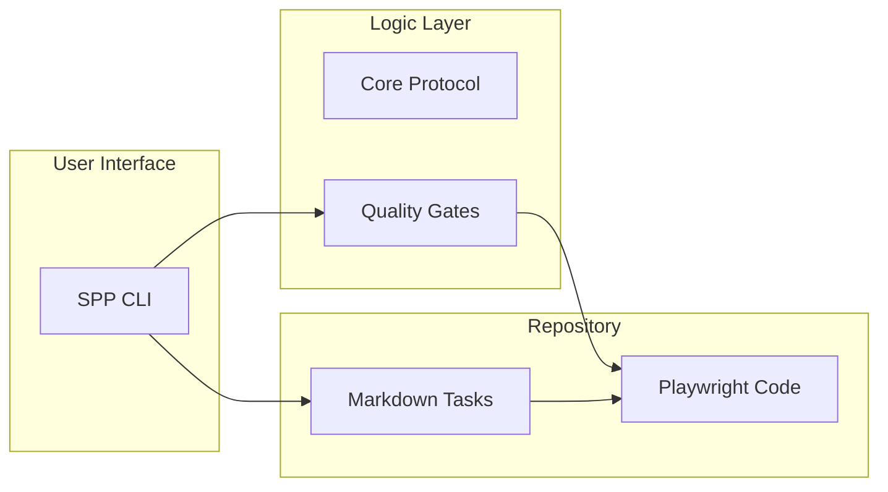

Smart Playwright Protocol is built on a simple, modular architecture that ensures human-AI collaboration is robust and reviewable.

### Core Components

### The Role of Each Component

#### 1. Task Files (`tasks/`)
The **Source of Truth** for all work. They define the "What" and "Why" of a task. They are human-readable, AI-friendly, and version-controlled.

#### 2. The CLI (`scripts/task.ts`)
The **Operational Interface**. It moves tasks through their lifecycle, enforces the protocol, and handles the "Handoff" to AI by generating precise prompts.

#### 3. The Protocol
The **Architectural Source of Truth**. It defines the rules of engagement: how tasks move between states, how selectors should be handled, and what constitutes "DONE."

#### 4. Verification Gates
The **Authority on Completion**. These are automated checks (Lint, Health Checks, Tests) that must pass before a task can be marked `DONE`.

#### 5. Playwright Code (`pages/`, `tests/`)
The **Functional Layer**. This is where the actual Page Objects and Playwright tests live. This code is generated by AI but governed by the Protocol.

### Relationship Overview

| Component | Responsibility | Governed By |
| :--- | :--- | :--- |
| **Tasks** | Define Objective | Human |
| **CLI** | Manage Workflow | Protocol |
| **Verification** | Enforce Quality | Protocol |
| **Code** | Implement Logic | AI Assistant |

:::note
For the full technical details of the protocol rules and states, see the [Protocol Reference](/test-playwright-protocol/reference/protocol/).
:::
