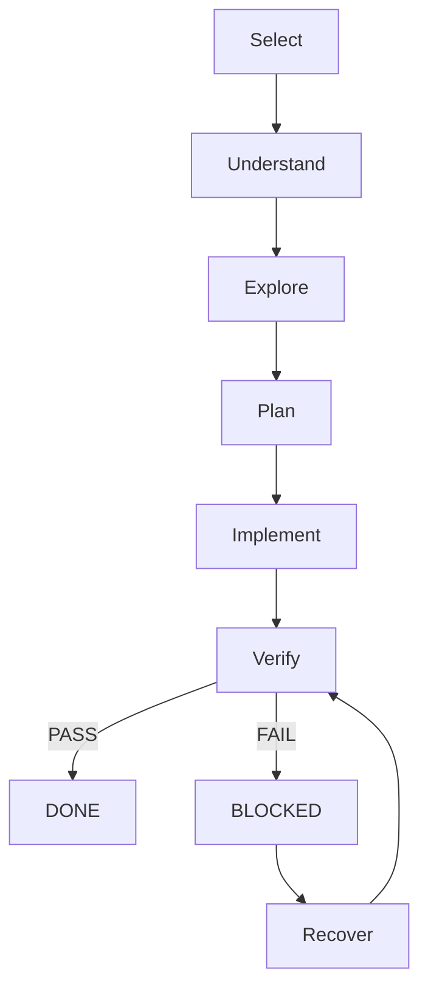

import { Card, CardGrid } from '@astrojs/starlight/components';

## What is SPP?

Smart Playwright Protocol (SPP) is a lightweight, file-backed workflow designed to make AI-assisted automation predictable, reviewable, and verifiable. It shifts the AI's role from "coding by hope" to "implementing by protocol."

## Why SPP exists?

Most AI coding tools follow a fragile "Prompt → Code → Hope" pattern. SPP introduces a disciplined lifecycle that ensures every change is verified against business requirements and repository standards before it's considered complete.

## How it works?

SPP uses Markdown **Task Files** as the source of truth. A local CLI moves these tasks through a structured lifecycle, generating precise handoff prompts for AI assistants and automated quality gates for verification.

<CardGrid stagger>
	<Card title="Verification First" icon="approve-check">
		Every task must pass automated quality gates and tests before it is considered DONE.
	</Card>
	<Card title="Markdown Tasks" icon="document">
		Work is tracked in human-readable, AI-friendly Markdown files stored directly in your repo.
	</Card>
	<Card title="Quality Gates" icon="setting">
		Automated checks enforce best practices like ARIA-first selectors and Page Object patterns.
	</Card>
	<Card title="Human + AI Collaboration" icon="pencil">
		Explicit handoffs and repair prompts keep the collaboration loop tight and productive.
	</Card>
	<Card title="Simple Architecture" icon="rocket">
		No complex databases or multi-agent systems. Just files, a CLI, and Playwright.
	</Card>
</CardGrid>

## Who is it for?

- **SDETs** looking to leverage AI without sacrificing quality.
- **QA Teams** transitioning to automated testing with AI assistance.
- **Developers** who want a structured way to build robust Playwright suites.

## How do I get started?

The best way to experience SPP is to run your first task. It takes less than 5 minutes to set up.

[Get Started with the Quick Start Guide](/test-playwright-protocol/quick-start/)
